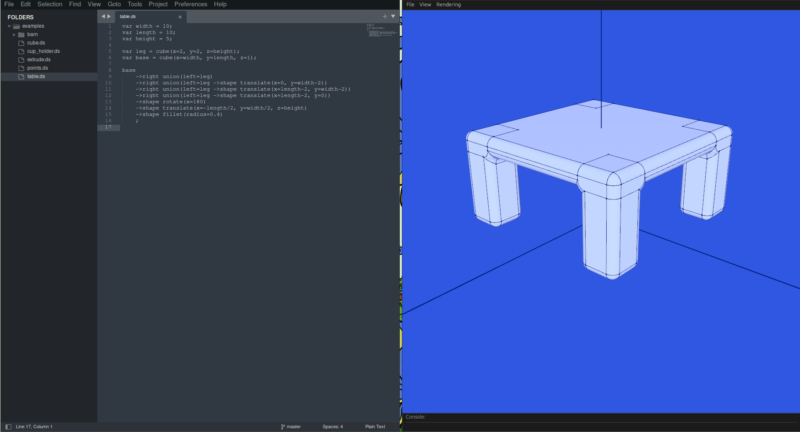

# DSLCAD (Pronounced DieselCAD)

DSLCAD is a programming language & interpreter for building 3D models.

Inspired by OpenSCAD, it has a language and 3D viewer to simplify the modeling experience.



## Setup 

Dependencies:
 - Rust
 - Just (https://github.com/casey/just)

To build run:
```sh
just build
```

This will first build OCCT if needed. Then build the rest of the app. OCCT is cached in the `occt_prebuilt` folder.

## Usage

Check out the [documentation](https://dschroer.github.io/dslcad/) pages.

## Installation

Download the latest DSLCAD from the [Releases](https://github.com/DSchroer/model-script/releases) tab of this repo. 

You can find pre-built binaries for:
- Windows
- MacOS
- Linux
- Browsers (WebAssembly)

## FAQ

### What are you focusing on?

Right now there are two apps:
- DSLCAD CLI
- DSLCAD Editor

I am focusing on the CLI. Right now I don't have the energy to develop
for the editor. I would like to do editor work but I do not have enough energy.
If anyone wants to contribute I would appreciate it. 

### Why is this different from OpenSCAD?

DSLCAD aims to build upon the formula that was established by OpenSCAD. It is 
still functional in approach and has a more limited scope (no text editor). It has 
a viewer for rapid part development and a CLI for automation. 

It offers some novel ideas such as:
- `chamfer` and `fillet` operators to simplify part creation
- the ability to create multiple parts (3D models) from a single file
- object style properties to access variables `my_gear.radius`
- top to bottom readability using pipes (the `->` operator) to reduce nesting complexity
- a single binary per platform for portability
- focused workflow with the aim of using the 2D first then 3D part design flow
- written in Rust to make it easy to build and contribute to
