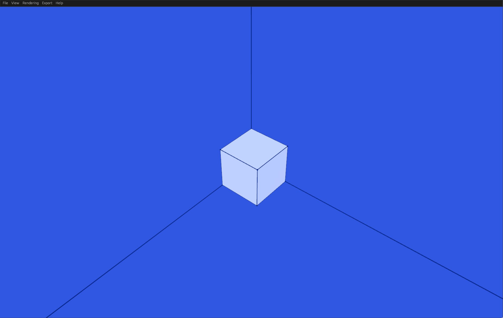

# Getting Started

DSLCAD is a parametric CAD package. It offers a programming language & interpreter for building 3D models. It is designed 
for the 3D printing space but is flexible for use in other areas.

DSLCAD is free, open source and cross-platform!

Inspired by [OpenSCAD](http://openscad.org/), it has a language and 3D viewer to simplify the modeling experience.


## Features

- 100% scriptable parametric modeling
- Fully cross-platform
- Built in preview tool
- Web compatible

## Installation

Download the latest DSLCAD from the [Releases](https://github.com/DSchroer/dslcad/releases) page or use the [Online Editor](editor.md) to try it out.

DSLCAD is available for:

- Windows
- MacOS
- Linux

Download the zip file for your system and extract it.

## Hello World

To create a DSLCAD program, create a new `hello.ds` file.
Edit the file and add the following code:

<div class="tryme">

```
// create a simple cube
cube();
```

</div>

Now render it in DSLCAD:

```sh
dslcad ./hello.ds --preview
```

You should see the preview open with a cube:
{: style="height:250px;aspect-ratio:auto"}

To learn more, check out the [concepts](concepts.md) page.